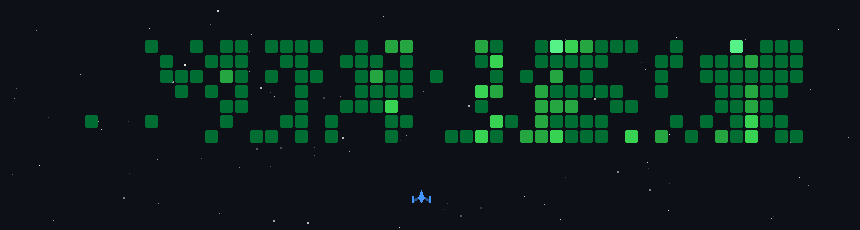

## 🛠️ Build Arsenal

<!-- ARSENAL_START -->

  
  
  
  
  
  
  
  
  
  
  
  

<!-- ARSENAL_END -->

---

## 📱 My Device

| Device Name | Codename | Chipset | Role |
| :--- | :--- | :--- | :--- |
| **POCO X6 5G / RN13 Pro 5G** | `garnet` | Snapdragon 7s Gen 2 | Main Driver / Build Target |

---

## 📫 Let's Connect!

  

  <em>Let's build something awesome. 🤝</em>

---

  

<h2 align="center">GitHub Stats</h2>

  

  

  

  

###

  Compiling with 💙 by <strong>Alhaidar Latif</strong>

